## [BE] Эндпоинт /vacancies возвращает некорректные данные при фильтрации

### Приоритет

**High** - система не справляется со своей основной функцией

### Обоснование

Корневая проблема в бэкенде, вызывающая множественные ошибки отображения на фронтенде. Эндпоинт обработки фильтров выдаёт некорректные данные.

### Шаги воспроизведения

1. Выполнить GET запрос к `/vacancies` с параметрами:
   - `q=Аналитик`
   - `direction=data-science`
   - `location[]=sankt-peterburg`
   - `format[]=26929`
   - `managers=Y`

### Фактический результат

- В ответе `counts.DIRECTION` содержит нерелевантные направления (`analitika-dannykh`)
- В UI присутствуют вакансии не из направления Data Science
- В категории "Data Science" есть только 1 вакансия, но счётчик показывает что их 2
- В данных вакансий `data-vacancy-geo` содержит "Санкт-Петербург, Удалённая работа" вместо только города

### Ожидаемый результат

- В `counts.DIRECTION` только актуальные направления по фильтрам
- В UI только вакансии направления Data Science
- `counts.DIRECTION["data-science"]` точно соответствует количеству вакансий в секции
- В `data-vacancy-geo` указан только город ("Санкт-Петербург"), формат работы в отдельном атрибуте

### Окружение

- API Version: v2
- Environment: staging

### Пояснение

здесь я скомпоновал несколько багов в 1, привязав к нему дочерние. В описании фактического результата и ожидаемого результата я брал характеристики эндпоинта с сайта "Avito Team", в реальной работе я бы лишний раз уточнил то, какие параметры в эндпоинте за что отвечают.

---

## [FE] Блок "Ничего не нашлось" отображается при наличии вакансий

### Приоритет

**High** - ломает доверие к системе

### Блокируется

[BE] Эндпоинт /vacancies возвращает некорректные данные при фильтрации

### Шаги воспроизведения

1. Перейти на страницу вакансий
2. Ввести в строку поиска текст "Аналитик".
3. Выбрать направление "Data Science"
4. Выбрать город "Санкт-Петербург"
5. Выбрать формат работы "Можно удалённо"
6. Отметить чекбокс "Руководящая роль"

### Фактический результат

Отображается блок "Ничего не нашлось" вместе со списком вакансий

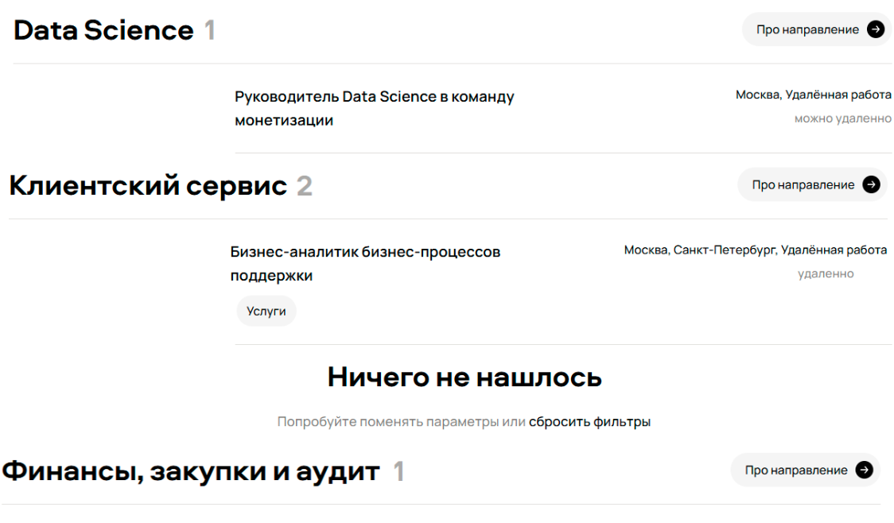

### Ожидаемый результат

Отображается только блок "Ничего не нашлось". Данный блок отображается тогда, когда вакансий 0
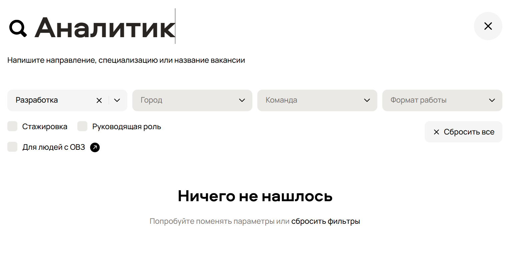

### Окружение

- Browser: Chrome 125
- OS: Windows 11

### Приложения

### Пояснение

я поставл этот баг на FE, думаю что проблема именно в обработке ответа от сервера, так как в списке вакансий для направления "Клиентский сервис" значание вакансий может быть прмерно таким:

```json
[{...}, null]
```

из-за чего меняется и значение в счётчике, и выводится блок "Ничего не нашлось", так как null преобразовывается в "Ничего не нашлось"

---

## [FE] Счётчик вакансий в направлениях показывает неверное количество

### Приоритет

**High** - ломает доверие к мета-информации

### Блокируется

[BE] Эндпоинт /vacancies возвращает некорректные данные при фильтрации

### Шаги воспроизведения

1. Ввести в строку поиска текст "Аналитик".
2. Выбрать направление "Data Science"
3. Выбрать город "Санкт-Петербург"
4. Выбрать формат работы "Можно удалённо"
5. Отметить чекбокс "Руководящая роль"
6. Смотреть на цифры рядом с названиями направлений

### Фактический результат

Счётчик показывает "2" при одной вакансии в направлении "Клиентский сервис"
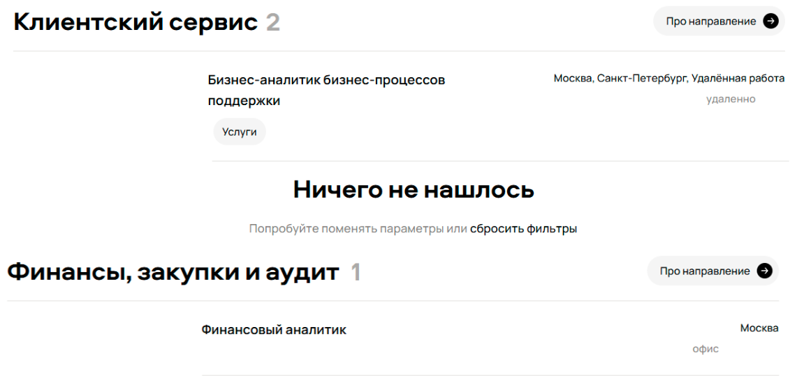

### Ожидаемый результат

Цифра точно соответствует количеству вакансий в направлении
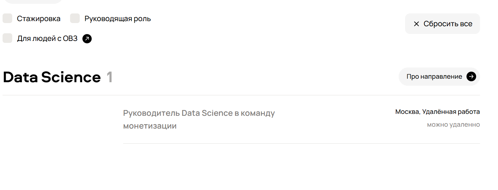

### Окружение

- Browser: Chrome 125
- OS: Windows 11

### Пояснение

я поставл этот баг на FE, думаю что проблема именно в обработке ответа от сервера, так как в списке вакансий для направления "Клиентский сервис" значание вакансий может быть прмерно таким:

```
[{...}, null]
```

из-за чего меняется и значение в счётчике, и выводится блок "Ничего не нашлось"

---

## [BE] В ответе эндпоинта присутствуют нерелевантные поиску вакансии

### Приоритет

**High** - ломает функцию поиска

### Блокируется

[BE] Эндпоинт /vacancies возвращает некорректные данные при фильтрации

### Шаги воспроизведения

1. Ввести в строку поиска текст "Аналитик".
2. Выбрать направление "Data Science"
3. Выбрать город "Санкт-Петербург"
4. Выбрать формат работы "Можно удалённо"
5. Отметить чекбокс "Руководящая роль"
6. Проверить ответ API /vacancies

### Фактический результат

В ответе есть вакансии из других направлений ("Поддержка пользователей", "Аналитик"), с городами отличающимися от "Санкт-Петербург", вакансии содержат форматы работы помимо "Можно удалённо", есть вакансии на не "Руководящая роль"

### Ожидаемый результат

В ответе только вакансии, соответствующие всем применённым фильтрам

### Окружение

- API Version: v2
- Environment: staging

---

## [BE] При выборе направления, применяется нерелевантный список направлений

### Приоритет

**High** - ломает функцию поиска

### Блокируется

[BE] Эндпоинт /vacancies возвращает некорректные данные при фильтрации

### Шаги воспроизведения

1. Ввести в строку поиска текст "Аналитик".
2. Выбрать направление "Data Science"
3. Проверить ответ API /vacancies

### Фактический результат

В списке выбранных направлений отображаются не релевантные направления, такие как "Поддержка пользователей" и "Аналитик".
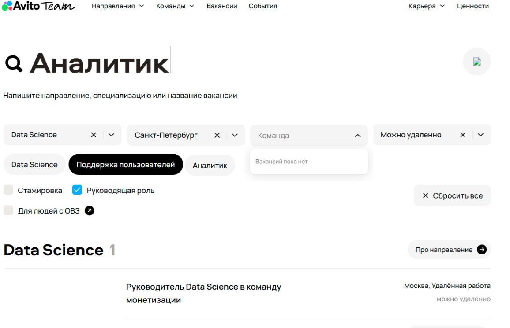

### Ожидаемый результат

В списке выбранных направлений отображаются только релевантные направления, в даном случае только "Data Science"
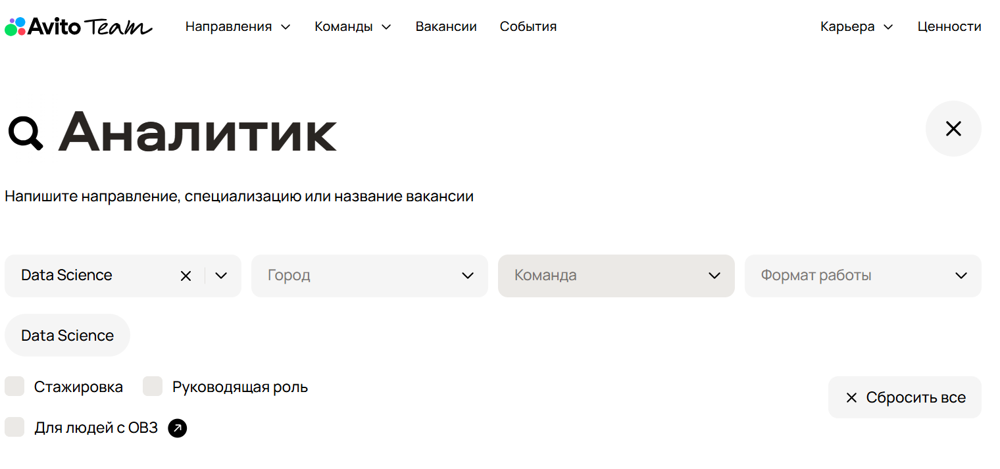

### Окружение

- API Version: v2
- Environment: staging

---

## [BE] Эндпоинт возвращает некорректные данные для поля "город"

### Приоритет

**Medium** - проблема с структурой данных

### Блокируется

[BE] Эндпоинт /vacancies возвращает некорректные данные при фильтрации

### Шаги воспроизведения

1. Выбрать город "Санкт-Петербург"
2. Проверить ответ API /vacancies
3. Найти в ответе поле для города для любой вакансии

### Фактический результат

- В поле для города приходит строка "Удалённая работа"
- В поле для города приходит пустое значение
- Формат работы смешан с данными о локации
  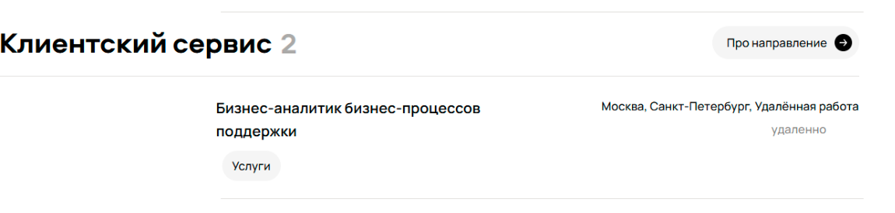
  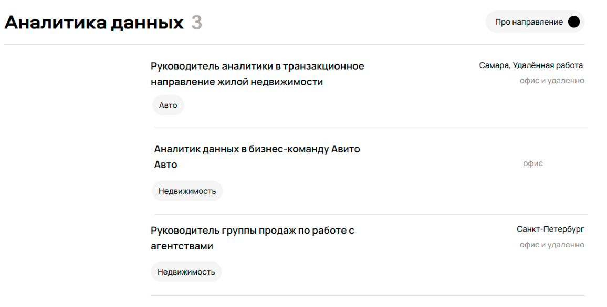

### Ожидаемый результат

- Поле для города содержит только название города
- Формат работы передается в отдельном поле формата работы под строкой с городом
- Поле для города никогда не бывает пустым для вакансий с офисом
  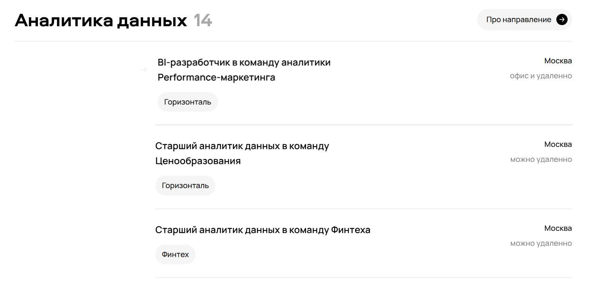

### Окружение

- API Version: v2
- Environment: staging

## [FE] Кнопка очистки поиска не отображает иконку крестика на странице вакансий

### Приоритет

**low** - Это баг визуальный (UI), а не функциональный.

### Обоснование

- Функция работает: из скрина могу предположить, что кнопка есть, она кликается, поле очищается.
- Проблема только в отображении иконки.
- Не блокирует основной сценарий поиска вакансий.
- Не приводит к потере данных или критическому неудобству.

### Шаги воспроизведения

1. Перейти на страницу вакансий [career.avito.com/vacancies](career.avito.com/vacancies)
2. Ввести в строку поиска любой текст (например, "Аналитик").

### Фактический результат:

В правой части строки поиска отображается невидимая/пустая кнопка. При наведении курсор меняется на pointer, клик очищает поле, но иконка крестика не отрисована.
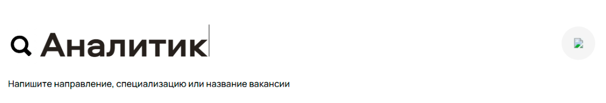

### Ожидаемый результат:

В правой части строки поиска отображается стандартная иконка крестика (X), указывающая на кнопку очистки поля.


### Окружение

- Browser: Chrome 125;
- OS: Windows 11;

### Вложения

### Примечания

Добавьте alt аттрибут картинке

## [FE] Кнопка "Про направление" не содержит стрелку

### Приоритет

**medium** - Это баг визуальный (UI), несмотря на это он сильно заметен и может ввести пользователя в заблуждение.

### Обоснование

- Функция работает: из скрина могу предположить, что кнопка есть, она кликается, и пользователь переходит на страницу про выбранное направление.
- Проблема только в отображении иконки.
- Не блокирует основной сценарий поиска вакансий.
- Не приводит к потере данных или критическому неудобству.

### Шаги воспроизведения

1. Перейти на страницу вакансий [career.avito.com/vacancies](career.avito.com/vacancies)
2. Ввести в строку поиска любой текст (например, "Аналитик").
3. Выбрать направление "Data Science"
4. Выбрать город "Санкт-Петербург"
5. Выбрать формат работы "Можно удалённо"
6. Отметить чекбокс "Руководящая роль"

### Фактический результат:

В правой части блока открытых вакансий по направлениям отображается кнопка "Про направление" с черным кругом справа от текста.
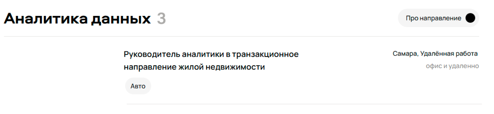

### Ожидаемый результат:

Справа от текста "Про направление" в чёрном кругу должна быть белая стрелка
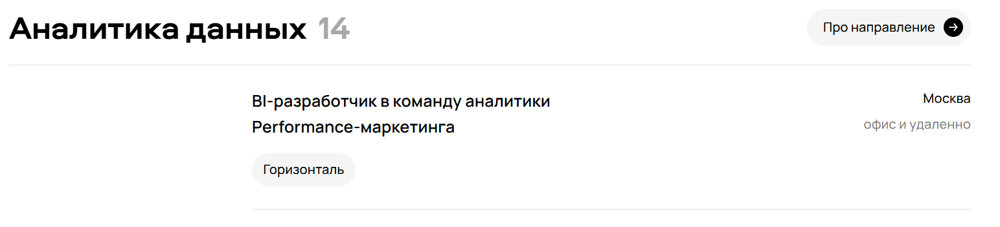

### Окружение

- Browser: Chrome 125;
- OS: Windows 11;

### Вложения

## [FE] Дроп-дaун "Команды" должен быть disabled, когда в нём нету опций

### Приоритет

**low** - Это баг визуальный (UI), может уточнятся у PM и дизайнера.

### Обоснование

Я решил что это баг, потому что на сайте [career.avito.com/vacancies](career.avito.com/vacancies) логика работы этого дроп-дауна именно такая

### Шаги воспроизведения

1. Перейти на страницу вакансий [career.avito.com/vacancies](career.avito.com/vacancies)
2. Ввести в строку поиска любой текст (например, "Аналитик").
3. Выбрать направление "Data Science"
4. Выбрать город "Санкт-Петербург"
5. Выбрать формат работы "Можно удалённо"
6. Отметить чекбокс "Руководящая роль"

### Фактический результат:

Дроп-даун "Команды" доступен
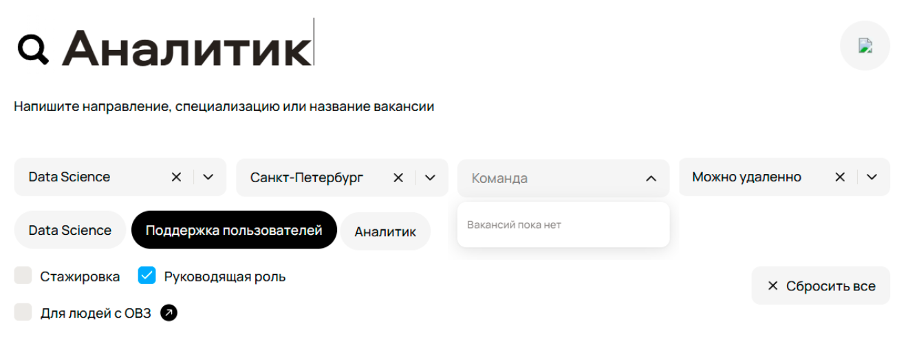

### Ожидаемый результат:

Дроп-даун "Команды" должен быть disabled
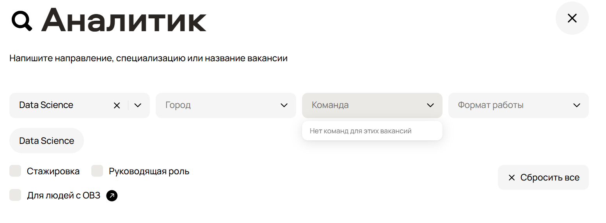

### Окружение

- Browser: Chrome 125;
- OS: Windows 11;

### Вложения

## [FE] Отступы между секциями вакансий по категориям малы

### Приоритет

**low** - Это баг визуальный (UI), может уточнятся у PM и дизайнера.

### Обоснование

Я решил что это баг, потому что на сайте [career.avito.com/vacancies](career.avito.com/vacancies) отступы между секциями вакансий по направлениям больше чем на представленном скрине

### Шаги воспроизведения

1. Перейти на страницу вакансий [career.avito.com/vacancies](career.avito.com/vacancies)
2. Ввести в строку поиска любой текст (например, "Аналитик").

### Фактический результат:

Отсупы не совпадают с UI на макете [career.avito.com/vacancies](career.avito.com/vacancies)
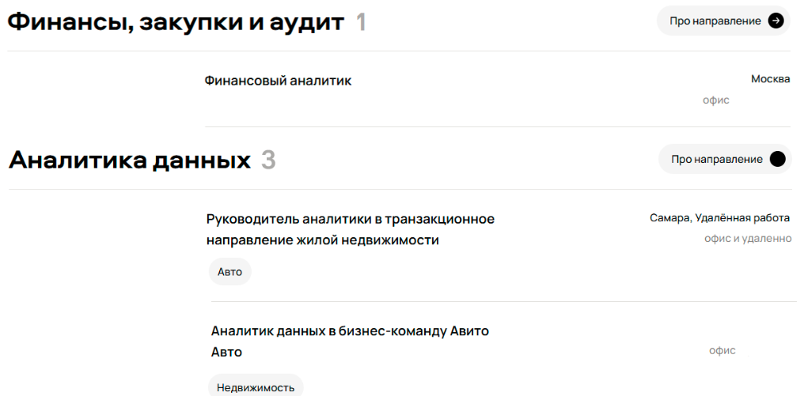

### Ожидаемый результат:

Отсупы должны совпадать с UI на макете [career.avito.com/vacancies](career.avito.com/vacancies)
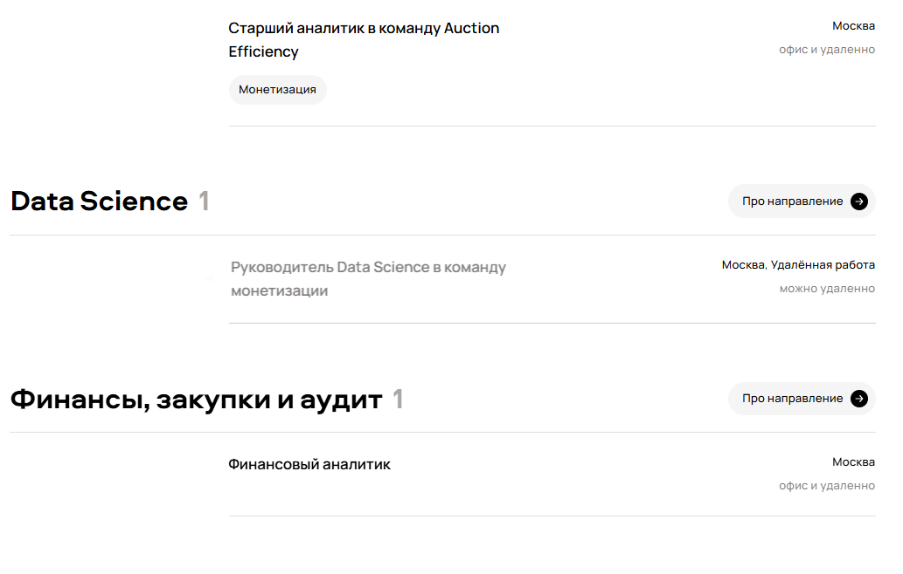

### Окружение

- Browser: Chrome 125;
- OS: Windows 11;

### Вложения

## [FE] Нижние рамки у вакансий не одинаковые

### Приоритет

**low** - Баг связан с UI

### Обоснование

Мне показалось, что нижние рамки у вакансий не одинаковые, так как проверить я это не смог то уточнять это необходимо с PM и дизайнером.
[career.avito.com/vacancies](career.avito.com/vacancies)

### Шаги воспроизведения

1. Перейти на страницу вакансий [career.avito.com/vacancies](career.avito.com/vacancies)
2. Ввести в строку поиска любой текст (например, "Аналитик").

### Фактический результат:

Нижние рамки блоков вакансий не одинаковы [career.avito.com/vacancies](career.avito.com/vacancies)
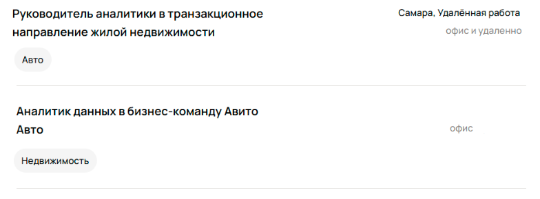

### Ожидаемый результат:

Нижние рамки блоков вакансий должны быть одинаковы [career.avito.com/vacancies](career.avito.com/vacancies)
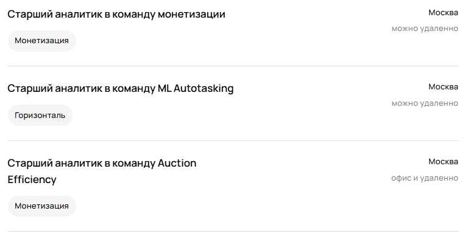

### Окружение

- Browser: Chrome 125;
- OS: Windows 11;

### Вложения
